# Lab 2 : CSE 508 Network Security


## Packet Sniffer
This is a basic packet sniffer made in accordance with lab 2 of CSE 508 Network Security Course. 

### Sample Usage and Sample Output
#### \[mysniffer.py\] With Specified Network Interface

```bash
sudo ./mysniffer.py -i eth0
```

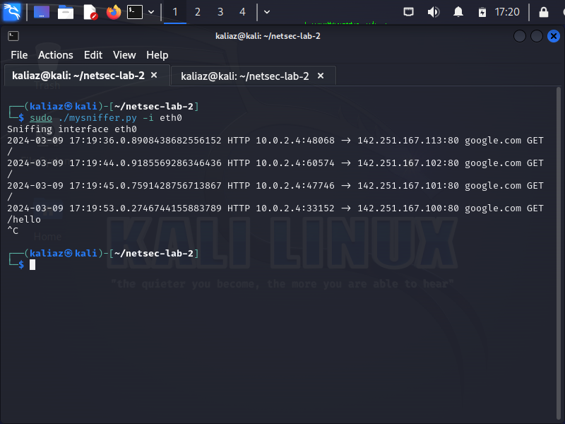


#### \[mysniffer.py\] With Specified PCAP file

```bash
sudo ./mysniffer.py -r hw2.pcap
```
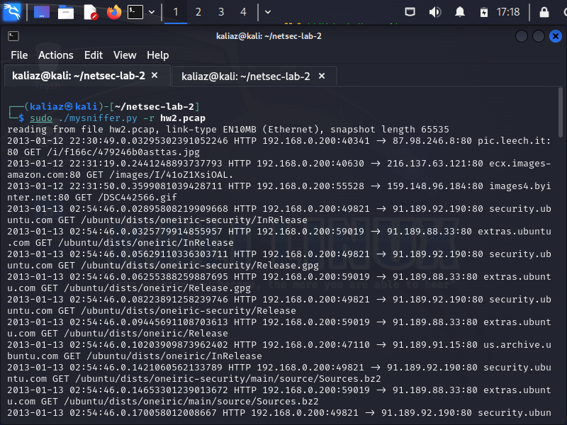

#### \[mysniffer.py\] With Default Interface (No interface and No pcap file provided)

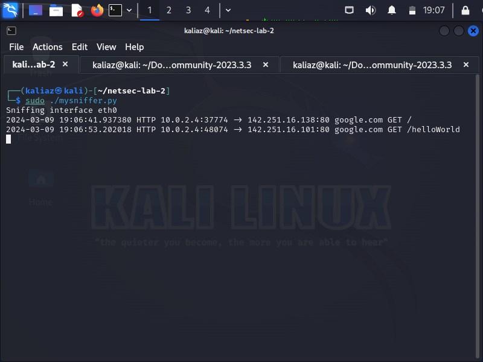


#### \[mysniffer.py\] POST Requests

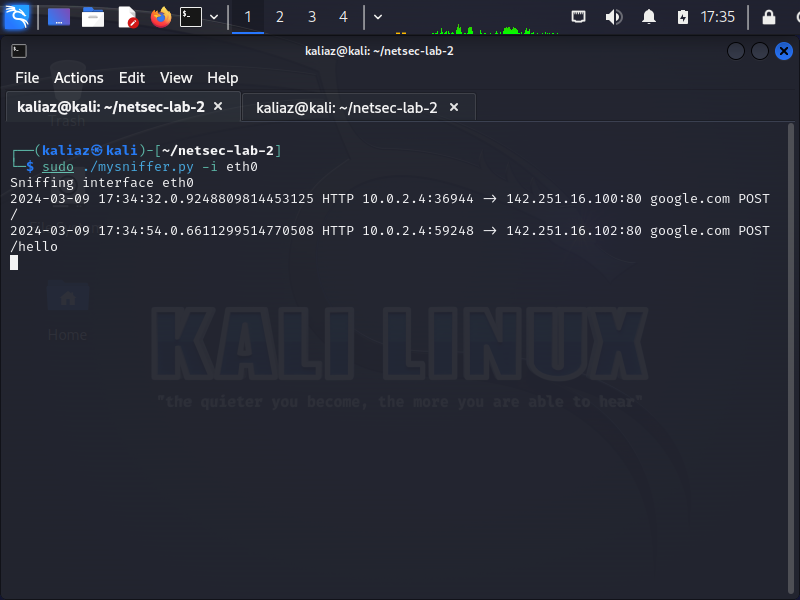

#### \[mysniffer.py\] BPF Filter

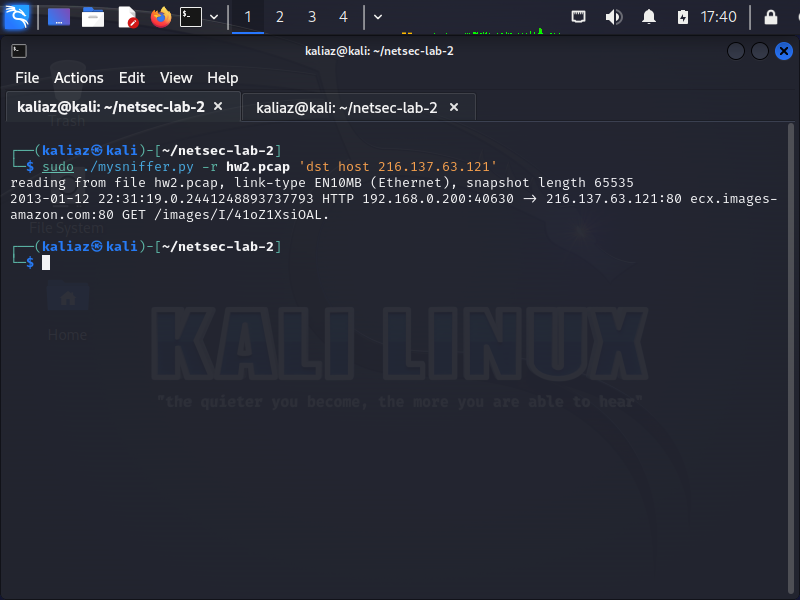


### Testing
#### \[mysniffer.py\] Different Versions of TLS on standard port
For testing on standard port on different versions of TLS, use the below curl commands

```bash
# TLSv1.3 on Standard Port
curl -X G--tlsv1.3 --tls-max 1.3 --ciphers DEFAULT@SECLEVEL=0 -vI https://www.google.com

# TLSv1.2 on Standard Port
curl -X G--tlsv1.2 --tls-max 1.2 --ciphers DEFAULT@SECLEVEL=0 -vI https://www.google.com    

# TLSv1.1 on Standard Port
curl -X G--tlsv1.1 --tls-max 1.1 --ciphers DEFAULT@SECLEVEL=0 -vI https://www.google.com 

# TLSv1.0 on Standard Port
curl -X G--tlsv1.0 --tls-max 1.0 --ciphers DEFAULT@SECLEVEL=0 -vI https://www.google.com  

```

#### \[mysniffer.py\] Different Versions of TLS on non-standard port
For testing on non-standard port of TLS, we used the https://portquiz.takao-tech.com website. 
This website is running on https and supports multiple non-standard ports like 9001, 8080, 80, 8, 666, etc.
I chose the non-standard port 9001 and different TLS versions for testing.
The following curl requests were made for testing tls requests on non-standard ports

```bash
# TLSv1.3 on Non-Standard Port
curl -X G--tlsv1.3 --tls-max 1.3 --ciphers DEFAULT@SECLEVEL=0 -vI https://portquiz.takao-tech.com:9001

# TLSv1.2 on Non-Standard Port
curl -X G--tlsv1.2 --tls-max 1.2 --ciphers DEFAULT@SECLEVEL=0 -vI https://portquiz.takao-tech.com:9001    

# TLSv1.1 on Non-Standard Port
curl -X G--tlsv1.1 --tls-max 1.1 --ciphers DEFAULT@SECLEVEL=0 -vI https://portquiz.takao-tech.com:9001  

# TLSv1.0 on Non-Standard Port
curl -X G--tlsv1.0 --tls-max 1.0 --ciphers DEFAULT@SECLEVEL=0 -vI https://portquiz.takao-tech.com:9001  

```

#### \[mysniffer.py\] Testing on Standard and Non-Standard Port for HTTP
Testing on custom port can be done via website http://portquiz.net:8080/. 
This website is running on http and supports multiple ports like 8080, 80, 8, 666, etc. 
The following curl requests were made for testing http requests
```bash
# For port 80, standard port 
curl -X GET http://portquiz.net

# For port 8080, non-standard port testing
curl -X GET http://portquiz.net:8080

# For port 8, non-standard port testing
curl -X GET http://portquiz.net:8

# For port 666, non-standard port testing
curl -X GET http://portquiz.net:666
```

#### Testing of TLS with custom HTTPS Server
This testing method is presented as an alternative for the above testing method for tls and is present in this documentation only for information purposes
This testing method must be used only if the above tls testing methods are absolutely not working. 
The file tls_server.py contains a quickly whipped up tls_server for testing purposes. 
You need to set up this server on a computer and then from a different computer on the same network,
you can call this server. Preferably both the computers should be linux. For testing, Macintosh operating
system was used. Below are the relevant steps

##### Step 1: Generate a Self-Signed SSL Certificate
First, use OpenSSL to generate a private key and a self-signed certificate. Open a terminal and run:
```bash
openssl req -x509 -newkey rsa:4096 -keyout key.pem -out cert.pem -days 365 -nodes
```

##### Step 2: Run the python server
```bash
python3 tls_server.py
```

##### Step 3: Connect to the Server
For connecting to the server, go on a different computer on the same network, figure out the IP address
of the computer where the server is running and then replace localhost in the below line with the 
IP address of the target computer
```bash
openssl s_client -connect localhost:8443
```

## Arpwatch 
This is a simple arp cache poisoning detector written to work on kali linux and in accordance with lab-2
for CSE 508 : Network Security

#### \[arpwatch.py\] With Specified Interface

```bash
sudo ./arpwatch.py -i eth0 
```

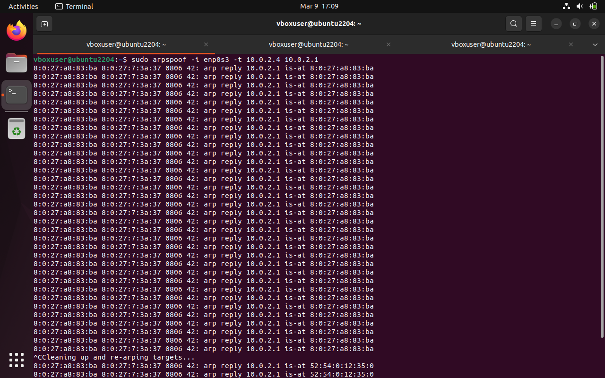

#### \[arpwatch.py\] With Default Interface

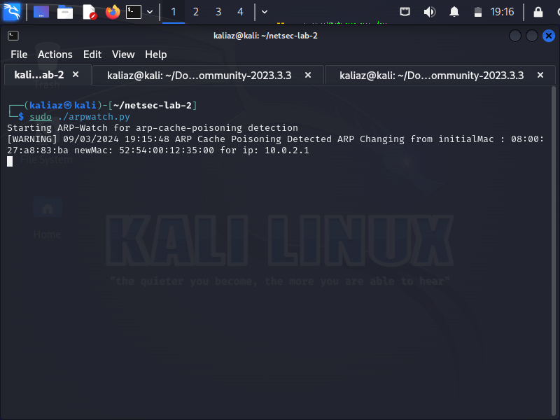

Let me explain the attacker and victim situation. 
There is one attacker machine(ubuntu machine) and one victim machine (kali-linux machine). 
The arpwatch.py script will be run on the victim machine in accordance with the lab requirements.
The arpwatch.py script will detect if there is an ongoing arp spoof attack on the victim machine
The attacker will launch full man in the middle attack using arpspoof command installed on ubuntu

Attacker IP Address : 10.0.2.15

Victim IP Address : 10.0.2.4

Gateway IP Address : 10.0.2.1

Attacker will have 3 terminals

***Attacker Terminal 1***

```bash
sudo arpspoof -i enp0s3 -t 10.0.2.4 10.0.2.1
```


***Attacker Terminal 2***

```bash
sudo arpspoof -i enp0s3 -t 10.0.2.1 10.0.2.4
```

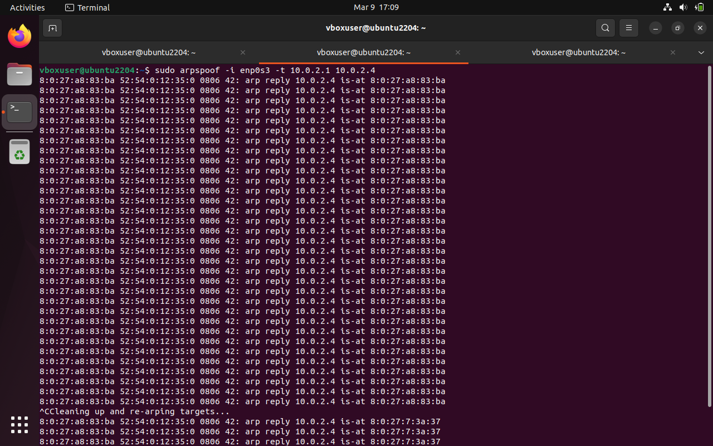


***Attacker Terminal 3***

The below is assuming that the attacker only wants to sniff icmp packets. 
This terminal is used only for demo purposes. This is one of the most interesting images of this 
documentation. Here we are sniffing the network packets arriving at the attacker's machine. 
Please note that we have enabled ipv4 port forwarding on ubuntu. Observe in this the packets
are not originating on the attacker's machine and the attacker is still able to see those packets. 
The attacker has now gained full Man-in-the-middle position.
Attacker can change the bpf filter at the end to sniff other packets. 
```bash
sudo tcpdump -i enp0s3 icmp
```

To enable ipv4 packet forwarding on ubuntu use the below command
```bash
sudo systctl -w net.ipv4.ip_forward=1
```

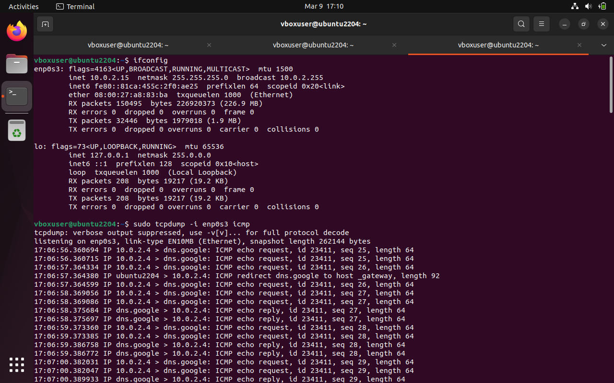


Victim will have 2 terminal open. One for running the arpwatch script. One for demo purposes

***Victim Terminal 1***

```bash
sudo ./arpwatch.py -i eth0
```
The below image indicates that the arpwatch.py script can successfully detect the 
arp spoofing attacks. 
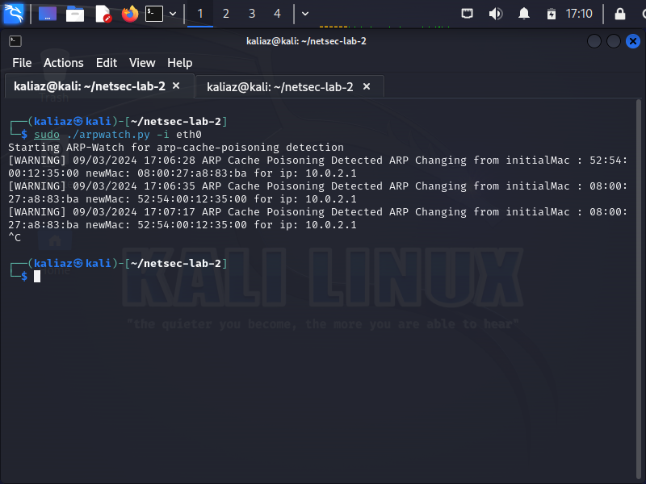


***Victim Terminal 2***

This is used to generate icmp packets for demo purposes
```bash
ping 8.8.8.8
```
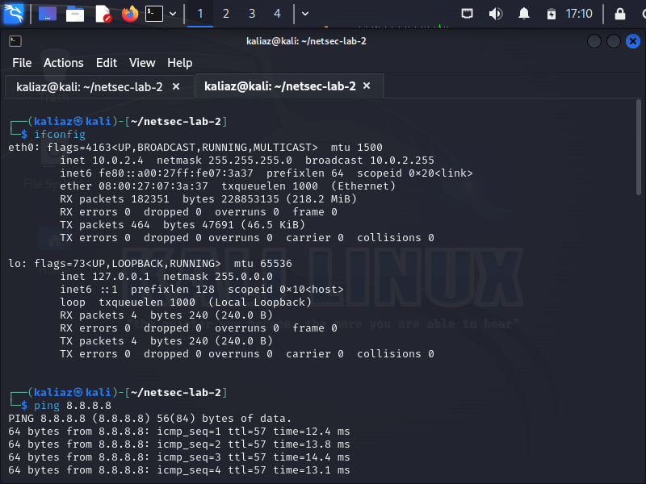

### Interesting Facts
When reading the /proc/net/arp file , the call may block if the file is not updated.  I would highly advise against reading the file continuously for each packet. This is because updates to this file don't happen after every packet and if the file is not updated then the call to read the file will block your code.